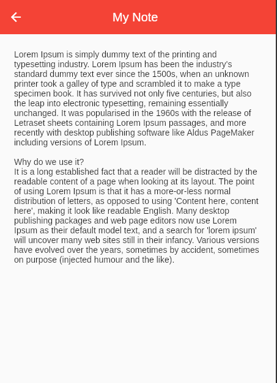

# NotesApp
## App de notas feito em Dart/Flutter

Aplicativo feito apenas para gerar conhecimento e tambem para praticar algumas tecnologias que venho estudando.

## Utilizado no projeto
- Flutter/Dart
- Shared_Preferences
- Gerencia de estado com o ValueNotifier e o ValueListenable
- Flutter Clean Architecture 

## Funcionalidades do aplicativo
- Criação de notas.
- Visualização das notas criadas.
- Exclusão de notas.

